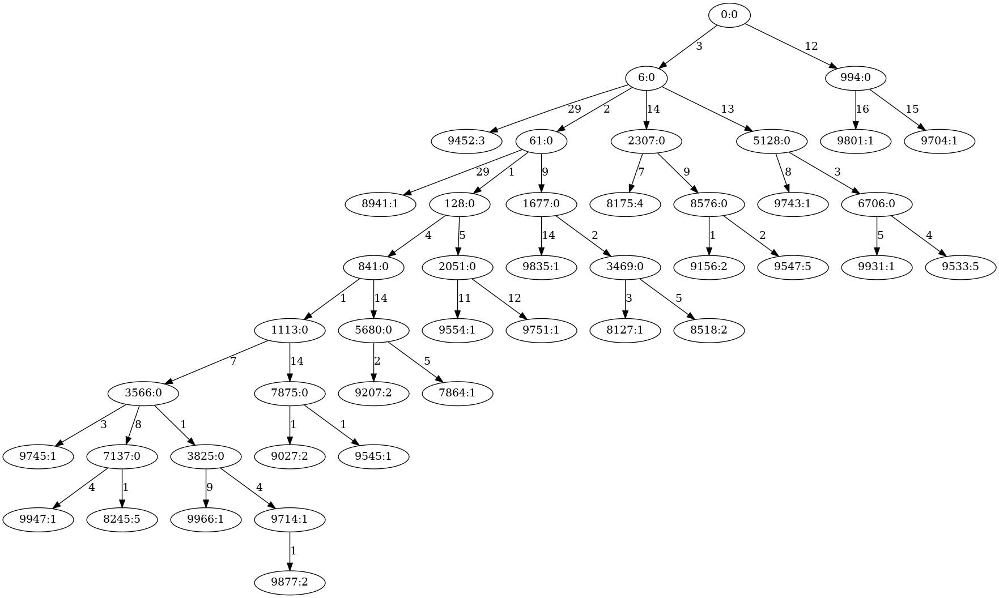

# SimChA: Simulator of Chromosomal Aberrations

SimChA is a research project at SchwarzLab.

## Requirements

### TL;DR; 

The program can be run on a platform of your choice in the provided *Conda* environment. Inside of the repo run 
```
conda env create --file simcha.yml
conda activate simcha
```

### Tested platforms

The program has been tested on:
* Windows 10 - PowerShell
* Windows 10 - WSL2 Ubuntu
* Ubuntu 20
* MacOS X 10 

### Simulation

The simulation code is written in **C# 8**. **.NET 5.0** or newer is requred. We recommend installation using *Conda*:
```
conda install -c conda-forge dotnet
``` 

### Data analysis

The analysis code is written in **Python 3.8**. The following packages are required (either from *Conda* or *Pip*):
```
conda install -c bioconda
conda install -c conda-forge biopython matplotlib numpy pandas seaborn pillow
```

## Execution

The default execution is:
```
git clone git@bitbucket.org:schwarzlab/simcha.git
cd simcha
dotnet run --project SimChA
./plots.sh
```

The results will be written to the folder `./out`

### Options

Use `dotnet run -- [options]` to specify any of the following:

```
  -O, --output    (Default: ./out) The path to the output files.
  -C, --config    (Default: ) A json file with configuration of the experiment.
  -I --input      A path to a newick file with the phylogenetic tree.
```

## Parameters

The following parameter values can be set in the configuration file:

* `Seed: int` The random seed for mutations generator.
* `IsFemale: bool` The higher the confinement the stronger the competition between clones.

## Output

The text files are primarily used as source for plots shown below.

#### `baf.out`

B-allele frequency of the selected clones. Used for copy number calculation in ASCAT / Refphase.

#### `copynumbers.out`

CN output in the format :


| sample_id | chrom | start | end | cn_a | cn_b |
|-----------|-------|-------|-----|------|------|

#### `logr.out`

Log-R calculation for the selected clones. Used for copy number calculation in ASCAT / Refphase.

#### `parent_graph.dot`

An evolutionary tree with mutation distances and population sizes between the individual subclones. The graph is written in the [DOT language](https://graphviz.org/doc/info/lang.html).

#### `parent_graph.new` 

The same as above, but in the [newick format](https://en.wikipedia.org/wiki/Newick_format).

#### `sim_params.json` 

Stores configuration parameters used for this simulation, including the random seed. If this file is provided on input, the exact same simulation will be executed.

#### `subclones.out`  

Information about the individual subclones at the end of the simulation. This file has the chromosome ranges. A range is in the format:

`ChromID*[start:end)`

where `*` is either `+` for 5' to 3' or `-` for 3' to 5'.

The start position is inclusive, the end exclusive.

### Plots (created by `./plots.sh`)

#### `parent_tree.png` 
An evolutionary tree describing the individual sampled clones and their total population (labelled nodes), together with their evolutionary distance from the parent (labelled edges).



#### `copy_numbers.png` 
The copy number tracks


## Contact
Email questions, feature requests and bug reports to Adam Streck, adam.streck@mdc-berlin.de.

## License
SimChA is available under the MIT License.