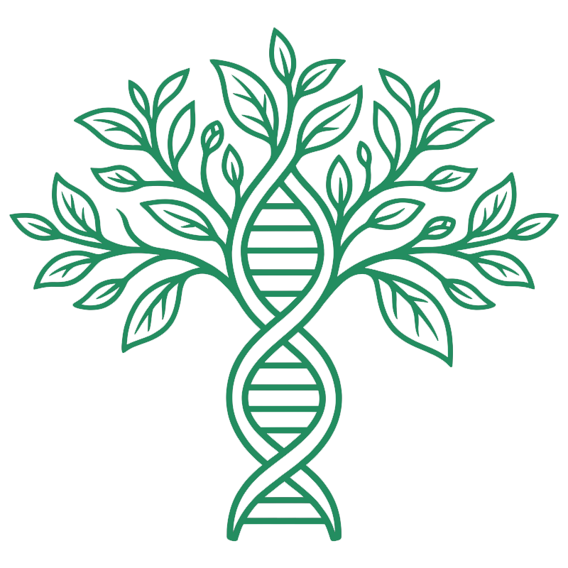
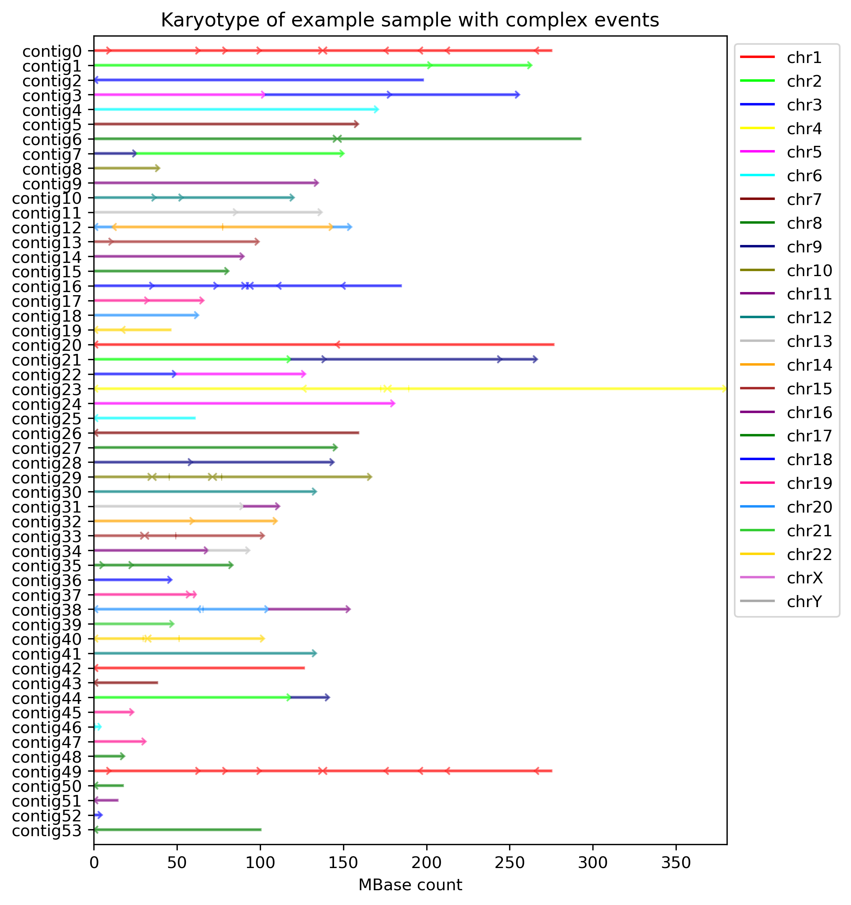
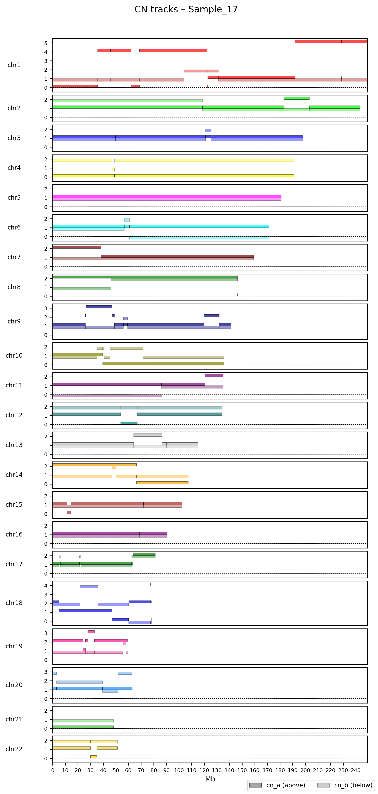

# SimChA: Simulator of Chromosomal Aberrations

<p align="center">

</p>
 
SimChA is a fitness-driven simulator of copy-number evolution. SimChA can simulate 22 event types and SNVs within 25 different cancer types, or use pan-cancer profiles.

SimChA can be used in three ways:
- `repeats N`: generates N repeats of the simulation, 
- `tree <phylogeny>`: generates a tree of clones based on the provided phylogeny structure,
- `profiles <cn_profiles>`: scores the provided CN profiles.

There are three basic modes of fitness:
- `basic`: events are selected at random, without considering fitness.
- `evolution`: events are selected based on their fitness, with a higher chance of selecting events that increase fitness.
- `matching`: events are selected to minimize the distance to a target fitness value provided on input.

The fitness is calculated based on the following principles:
- Tumor Suppressor Genes (TSG) and Oncogenes (OG) contribute to fitness, with TSG loss and OG gain increasing fitness.
- Essential genes contribute to fitness, with their full loss penalizing fitness.
- Abnormally high ploidy is penalized by a stress factor.

## Quick Start

For quickstart, Git >= 2.4 and Conda >= 22 (or equivalent) are required.

The program can be run on a platform of your choice in the provided *Conda* environment. 
The following commands should make SimChA display the available commands.

```
git clone git@bitbucket.org:schwarzlab/simcha.git
cd simcha
conda env create --file simcha.yml
conda activate simcha
dotnet run
```

### Tested platforms

The program has been tested on:
* Windows 11 - PowerShell
* Windows 11 - WSL2 Ubuntu
* Ubuntu 24.04
* MacOS X 10 

## Execution

The repository is a solution (`SimChA.sln`) with two projects: `SimChA`, the simulator,
and `Tests`, the unit test suite. `SimChA` is the default project — its `.csproj` sits at
the repository root (with sources in `src/`), so `dotnet run` runs the simulator directly:

```
git clone git@bitbucket.org:schwarzlab/simcha.git
cd simcha
dotnet run
```

The results will be written to the folder `./out`


### Options

Use `dotnet run -- [options]` to specify any of the following:

```
 
  -O, --output                 (Default: ./out) The path to the output files.

  -C, --config                 (Default: ./configs/main_config.json) A json file with configuration of the experiment.

  -T, --tree <path>            Clone-tree TSV/CSV file path. Required columns: ID, ParentID, Distance (int). Optional column: Fitness (float; only used/required with -m matching). Delimiter can be tab or comma.

  -R, --repeats <int>          (Default: 1) Positive integer number of independent repeats/samples in repeat mode. Optional when omitted (defaults to 1). Cannot be combined with -T or -P when value > 1.

  -P, --cnprofiles <path>      CNA profile TSV file path (tab-separated, header + at least 6 columns): SampleID, Chr, Start, End, CN_hap1, CN_hap2. Extra columns are optional/ignored. Start is interpreted as 1-based by default, or 0-based with -z.

  -m, --mode                   (Default: evolution) The event selection mode: 'basic' (events are selected at random), 'evolution' (events are selected to increase fitness), or 'matching' (events are selected to minimize the distance to a target fitness).

  -s, --segments               (Default: false) Write out copy numbers segments.

  -S, --consistent-segments    (Default: false) Write out copy number segments under a minimum consistent segmentation.

  -k, --karyotypes             (Default: false) Write out karyotype after each event.
  
  -d, --delta                  (Default: false) Write out the lost and gained regions for each event.

  -v, --variants               (Default: false) Write out VCF file with the variants of the final simulated karyotype. Requires `data/<assembly>/genome.fa` (e.g. `data/hg19/genome.fa`). Use `scripts/DownloadRefData.sh` to download it.

  -f, --fasta                  (Default: false) Write out a FASTA file for each sample. Requires `data/<assembly>/genome.fa` (e.g. `data/hg19/genome.fa`). Use `scripts/DownloadRefData.sh` to download it. WARNING! Average file size is 6GB per sample.

  -z, --zero-index             (Default: false) Flag for zero-indexed input copy number profiles.

  --root                       (Default: .) A path to the folder that will be considered root for relative paths.

  -h, --help                       Display this help screen.

  --version                    Display version information.
```

## Input files

Input files are only required for specific execution modes:

| Option | Used for | Required? |
|---|---|---|
| `-R, --repeats <int>` | Repeat-mode simulation (default mode when no `-T`/`-P` is given) | No input file required |
| `-T, --tree <path>` | Tree-mode simulation | Required in tree mode |
| `-P, --cnprofiles <path>` | Profile scoring mode | Required in profiles mode |

### Clone tree file (`-T`, `--tree`)

A `.tsv` or `.csv` file with a header row. The extension determines the separator: tab for `.tsv`, comma for `.csv`.

Columns:

* `ID` (string): clone/sample identifier
* `ParentID` (string): parent clone identifier
* `Distance` (int): number of events from parent to child
* `Fitness` (float): target fitness value — only read when using `-m matching`, otherwise ignored

The root is the row where `ParentID == ID`, or where `ParentID` does not match any `ID` in the file. Exactly one root is expected.

Minimal tree example (`.tsv`):

| ID | ParentID | Distance |
|---|---|---|
| A | A | 0 |
| B | A | 12 |
| C | B | 7 |

Matching-mode example (`.tsv`):

| ID | ParentID | Distance | Fitness |
|---|---|---|---|
| A | A | 0 | 0.0 |
| B | A | 12 | 3.5 |

### CNA profile file (`-P`, `--cnprofiles`)

A tab-separated file with a header row and at least 6 columns per data row. Additional columns are ignored.

First 6 columns (in order):

* `SampleID` (string)
* `Chr` (string, e.g. `chr1`)
* `Start` (int): 1-based by default; use `-z` for 0-based input
* `End` (int)
* `CN_hap1` (numeric, rounded to nearest int)
* `CN_hap2` (numeric, rounded to nearest int)

`chrX` and `chrY` rows are skipped when `SimParams.AutosomesOnly = true`.

Minimal CNA example (`.tsv`):

| SampleID | Chr | Start | End | CN_hap1 | CN_hap2 |
|---|---|---|---|---|---|
| S1 | chr1 | 1 | 248956422 | 1 | 1 |
| S1 | chr8 | 1 | 145138636 | 2 | 1 |

### Path resolution (`--root`)

Relative paths for `-T`, `-P`, `-C`, and output are resolved from the current working directory, or from `--root` if provided.


## Configuration files

Default parameters are found in the file: `./configs/main_config.json`. The exact parameters are dependent on the execution mode.

The default execution corresponds to running

`dotnet run -- --config ./configs/main_config.json`

This contains optimized simple event and fitness parameters for pan-cancer simulation. 

### Cancer-type configs

Pre-built configuration files for each cancer type (and pan-cancer) are provided in `./configs/`, organized into three subfolders:

| Location | Description |
|---|---|
| `configs/spice_<type>.json` | Optimized event profiles (hg19) derived from TCGA/PCAWG data. |
| `configs/hg38/spice_<type>.json` | Same as above with `SimParams.Assembly` set to `"hg38"`. |
| `configs/basic/spice_<type>.json` | Non-optimized profiles - these should be used with `basic` mode, since the WGD probability is not affected by stress. |

`<type>` is the TCGA cancer-type abbreviation (e.g. `LUAD`, `BRCA`) or `pancancer` for the pan-cancer profile.

| File Name | Full Name |
|---|---|
| `ACC` | Adrenocortical Carcinoma |
| `BLCA` | Bladder Urothelial Carcinoma |
| `BRCA` | Breast Invasive Carcinoma |
| `CESC` | Cervical Squamous Cell Carcinoma and Endocervical Adenocarcinoma |
| `COAD` | Colon Adenocarcinoma |
| `ESCA` | Esophageal Carcinoma |
| `GBM` | Glioblastoma Multiforme |
| `HNSC` | Head and Neck Squamous Cell Carcinoma |
| `KIRC` | Kidney Renal Clear Cell Carcinoma |
| `KIRP` | Kidney Renal Papillary Cell Carcinoma |
| `LGG` | Brain Lower Grade Glioma |
| `LIHC` | Liver Hepatocellular Carcinoma |
| `LUAD` | Lung Adenocarcinoma |
| `LUSC` | Lung Squamous Cell Carcinoma |
| `MESO` | Mesothelioma |
| `OV` | Ovarian Serous Cystadenocarcinoma |
| `PAAD` | Pancreatic Adenocarcinoma |
| `PCPG` | Pheochromocytoma and Paraganglioma |
| `PRAD` | Prostate Adenocarcinoma |
| `READ` | Rectum Adenocarcinoma |
| `SARC` | Sarcoma |
| `SKCM` | Skin Cutaneous Melanoma |
| `STAD` | Stomach Adenocarcinoma |
| `TGCT` | Testicular Germ Cell Tumors |
| `UCEC` | Uterine Corpus Endometrial Carcinoma |

### Customizing configuration

#### `SimParams`

The parameters controlling the simulation of events.

* `Seed: int (0)`: The seed for the random number generator. If < 0, the seed will be generated randomly on runtime.
* `Assembly: string ("hg19")`: The reference genome assembly to use (e.g. "hg19", "hg38").
* `Sex: ["Any", "Male", "Female"] ("Any")`: One of `Any`, `Male`, `Female`. If `Any`, then samples' sex will be generated with a random.
* `RateDist: ["Uniform", "Geometric", "Poisson"] ("Uniform")` - The distribution of the mutation rate.
* `RateMean: float (1.0)`: the mean of the mutation rate (mutations between two nodes).
* `TetraploidStart: bool (false)`: If true, the root karyotype will undergo a whole genome doubling before simulation begins.
* `AutosomesOnly: bool (false)`: If true, karyotypes will only contain autosomes (chromosomes 1-22), excluding sex chromosomes.
* `Mixture: ["Single", "Constant", "Dirichlet"] ("Constant")`: In case of multiple signatures, how are these mixed for each sample. `Single` means that only one signature is used (selected based on its relative probability), `Constant` means that each signature has a fixed probability of being selected, while `Dirichlet` means that the probabilities are drawn from a Dirichlet distribution.

#### `FitParams`

The parameters controlling the fitness of the samples. 

* `Stress: float (0.0)`: Stress penalizes abnormally high ploidy.
* `TsgOg: float (0.0)`: Affected by the number of Tumor Suppressors (TSG) and Oncogenes (OG) in the sample. TSG loss and OG gain increase fitness.
* `Essentiality: float (0.0)`: Penalizes full loss of essential genes.
* `GeneSet: string ("Empty")`: The gene set to use for fitness calculations (e.g. "spice_all"). This should be a folder name relative to the assembly directory.

#### `Signatures`

Signatures define the mutational processes that generate structural variants during simulation. Each signature contains:

* `Name: string`: A descriptive name for the signature.
* `Prob: double`: The relative probability of this signature being selected (compared to other signatures).
* `Events: array`: A list of event types with their parameters and probabilities.

The `Mixture` parameter in `SimParams` controls how multiple signatures are combined:
* `Single`: Only one signature is selected per sample based on relative probabilities.
* `Constant`: Each signature maintains a fixed probability throughout simulation.
* `Dirichlet`: Signature probabilities are drawn from a Dirichlet distribution for each sample.

See the Signatures section below for details on configuring individual event types.

#### Fitness Matching Mode

When using `-m matching` (fitness matching mode), events are selected using the same mechanism as evolution mode, but instead of maximizing fitness, each event is chosen to minimize the distance to a target fitness value. The `EvoParams.MaxTries` parameter controls the full candidate-search budget per step. Across that budget, the existing acceptance rule is still evaluated, but its influence fades smoothly from early tries to late tries, so the search transitions continuously from exploration toward strict best-match selection.

#### `EvoParams`

The parameters controlling the evolutionary mode of event simulation (selection of events based on fitness).

* `Acceptance: float (0.0)`: See publication for details. The higher the value, the less likely an event is to be accepted. Usually between 0 and 1.
* `MaxTries: int (1)`: How many candidate events are sampled before matching mode settles on the best available event or gives up and moves to the next sample.
* `Decay: float (0.0)`: Used in fitness matching mode (`-m matching`). Controls how strongly the acceptance rule influences candidate selection during the early part of the try budget. The decay increases linearly from 0 (first event) to `Decay` (last event), so earlier events get more exploration pressure, while later events lean more quickly toward pure distance-to-target matching.

### Working path

The `--root` option sets the base directory used to resolve all relative paths. By default it is `.` (the working directory from which the command is run), so paths like `./configs/main_config.json` and `./out` resolve relative to wherever you invoke `dotnet run`.

If you run SimChA from a different directory — for example via a script or a workflow manager — set `--root` to the repository folder so that default config and output paths resolve correctly without having to specify each one individually:

```bash
dotnet run -- --root /path/to/simcha
```

With this setting, `./configs/main_config.json` resolves to `/path/to/simcha/configs/main_config.json` and `./out` to `/path/to/simcha/out`, regardless of the current working directory.

## Input Data

Reference data is located in the `data/` folder, organized by assembly name (matching `SimParams.Assembly`). 
Each assembly folder needs to contain description of the chromosomes, centromeres, and gene score files in a subfolder (matching `FitParams.GeneSet`). 
We provide `GRCh37` and `GRCh38` in the folders `./data/hg19` and `./data/hg38` respectively.

### Chromosomes
> `chromosomes.tsv`

The chromosome file contains two columns, one with the name of a chromosome, one with its number of bases.

Example file:

```
chr1	248956422
...
chrY	59373566
```

### TSG/OG/Eseentiality Score
> `tsgs_select.tsv`, `ogs_select.tsv`, `essentials_select.tsv`

We use three data files, providing the TSG/OG/Essentiality score. Each file is a tab-separated file with the following columns:

* `Chromosome: string` - The name of the chromosome.
* `Start: long` - The start position of the gene (inclusive).
* `End: long` - The end position of the gene (inclusive).
* `Gene: string` - The name of the gene.
* `Score: float` - The score of the gene.

Example file:
```
chr3	178865902	178957881	PIK3CA	1
chr7	140419127	140624564	BRAF	0.991919559
chr12	25357723	25403870	KRAS	0.990684897
...
```

For each gene, the:

* TSG score is the probability that the gene is a Tumor Suppresor Gene (TSG) 
* OG score is the probability that the gene is an Oncogene (OG) 
* Essentiality score is the log2 fold change in the reproducibility of a cell after a knock-out of the gene (both alleles).

### Centromeres
> `centromeres.tsv`

Each chromosome has a centromere for each arm, defined by a start and an end. The centromere information is given by three columns: chromosome name, start point, end point. Each chromosome has two rows, corresponding to the portions of the centromere belonging to the p- and q-arms of the chromosome.

It is also possible to provide a single row for each chromosome, corresponding to the whole centromeric region.

Example file:

```
chr1    121500000   125000000
chr1    125000000   128900000
...
chrY    11600000    12500000
chrY    12500000    13400000
```

## Signatures

SimChA simulates events based on mutational signatures. Each signature is a set of events and their associated parameters, for example consider the following excerpt from a configuration file:

```
"Signatures" : [
  {
    "Name" : "WoleChromEvents"
    "Prob": 1,
    "Events": [
      {
        "Type": "ChromDeletion",
        "Prob": 1
      },
      {
        "Type": "ChromDuplication",
        "Prob": 2
      }        
    ]
  },
  {
    "Name": "InternalEvents"
    "Prob": 5,
    "Events": [
      {
        "Type": "InternalDeletion",
        "Prob": 1,
        "Size": 1000000
      },
      {
        "Type": "InternalDuplication",
        "Prob": 7,
        "Size": 500000
      }
    ]
  }
]
```
These are two signatures, one for Whole Chromosome Events and one for Internal events. The likelihood of a signature being selected is 1 : 5, meaning the Internal is 5 times as likely. 

If the WholeChromEvent is selected, the probability of a deletion compared to duplication is 1 : 2. SimChA works with *contigs*, i.e. contiguous sequences of bases. A deletion or duplication will be a deletion or duplication of a contig. A contig may be comprised of parts of different chromosomes, e.g. after a translocation, however at the start of simulation, the set of contigs is the same as the set of chromosomes.

If the Internal Deletion is selected, the mean size of a deleted segment will be 1MB, distributed exponentially, while Internal Duplication events will have a mean segment size of 500kB.

Each Event has an associated type and a probability, which is relative to all the other events in the signature. The following events are available:

* `ChromDuplication`
* `ChromDeletion`
* `TailDuplication`
* `TailDeletion`
* `CentromereBoundDuplication`
* `CentromereBoundDeletion`
* `ArmDuplication`
* `ArmDeletion`
* `InternalDuplication`
* `InternalDeletion`
* `InternalInversion`
* `InvertedDuplication`
* `Translocation`
* `BreakageFusionBridge`
* `WholeGenomeDoubling`
* `Chromothripsis`
* `Chromoplexy`
* `TIChain`
* `TICycle`
* `TIBridge`
* `Pyrgo`
* `Rigma`
* `SNV`

Events have parameters from the following:
* `Type: string` - The type of the event, one from the list above.
* `Prob: double` - The probability of the event being selected.
* `Frac: double` - The mean size of the event as a fraction of contig length, exponentially distributed. Only applicable to internal, tail, and centromere-bound events.
* `Frag: double` - Some complex events cause fragmentation, this is the mean number of fragments.

### Chromosome Deletion (Prob)

A single contig is selected at random and removed.

### Chromosome Duplication (Prob)

A single contig is selected at random and duplicated.

### Arm Deletion (Prob)

For a contig with at least once centromere, one of the arms is selected at random and removed - the end within the centromere is selected uniformly.

### Arm Duplication (Prob)

For a contig with at least once centromere, one of the arms is selected at random and duplicated - the end within the centromere is selected uniformly.

### Whole Genome Doubling (Prob)

All the existing contigs are duplicated.

### Tail Deletion (Prob, Frac)

A tail of a length given by the `Frac` parameter is removed from an end of a contig. The end is selected by a coin flip.

### Tail Duplication (Prob, Frac)

A tail of a length given by the `Frac` parameter is duplicated from an end of a contig. The duplicated segment is placed at the same end. The end is selected by a coin flip.

### Internal Deletion (Prob, Frac)

A single contig is selected, from which a segment distributed by along the `Frac` parameter is removed. The position of a segments is guaranteed to be internal and uniformly distributed.

### Internal Duplication (Prob, Frac)
A single contig is selected, from which a segment distributed by along the `Frac` parameter is duplicated. The position of a segments is guaranteed to be internal and uniformly distributed. This segment is pasted directly after its original position.

### Internal Inversion (Prob, Frac)
A single contig is selected, from which a segment distributed by along the `Frac` parameter is inverted. The position of a segments is guaranteed to be internal and uniformly distributed.

### Inverted Duplication (Prob, Frac)
Like a duplication, but the segment is inverted before being pasted.

### Centromere-Bound Duplication (Prob, Frac)

For a contig with at least one centromere, a segment is selected that extends from within the centromere to a distance given by the `Frac` parameter. The breakpoint within the centromere is selected uniformly. This segment is then duplicated.

### Centromere-Bound Deletion (Prob, Frac)

For a contig with at least one centromere, a segment is selected that extends from within the centromere to a distance given by the `Frac` parameter. The breakpoint within the centromere is selected uniformly. This segment is then deleted.

### Translocation  (Prob, Frac)
Two contigs are selected, from which a segment distributed along the `Frac` parameter is swapped. The position is selected individually for each contig. A coin flip decides if one of the segments is inverted before being pasted.

### BreakageFusionBridge (Prob, Frac)

A contig and its tail is selected (see above). The tail is then removed, the rest is copied, the copy is reversed and the two copies are  connected on the breakage location.

### Chromothripsis (Prob, Frac)

1. A contig is broken into a number of fragments, such that the fragment size is distributed exponentially with a mean of `Frac`.
2. Have, `f` the number of fragments from step 1). A `k` framgents are then randomly selected such that `0 < k <= f`.
3. The `k` fragments are then reassembled in a random order, potentially with inverted orientations.
4. The result is a highly rearranged chromosomal region with multiple breakpoints clustered in one genomic area.

### Chromoplexy (Prob, Frac, Frag)

1. A number `c` of contigs is selected, following the probability distribution listed below.
2. Each contig is broken into a number of fragments, such that the fragment size is distributed under normal distribution with a mean of `Frac`.
3. These contigs are then reassembled in a random order into a single contig.
4. This contig is broken down into  new contigs with mean number of contigs equal to  `Frag`. 

Probabilities are sourced from [Ashby et al., 2019](https://ashpublications.org/blood/article/134/Supplement_1/3767/424006/Chromoplexy-and-Chromothripsis-Are-Important):

* 3 contigs: 46%
* 4 contigs: 18%
* 5 contigs: 10%
* 6 contigs: 5%
* 2 contigs: 21%


### Pyrgo (Prob, Frac, Frag)

1. A contig is selected and a segment of length distributed along `Frac` is chosen.
2. This segment is fragmented into multiple pieces, with the number of fragments drawn from a geometric distribution with mean `Frag`.
3. Each fragment has a length drawn from an exponential distribution with mean `Frac / Frag`.
4. These fragments are then duplicated and randomly inserted throughout the genome, creating dispersed duplications.

### Rigma (Prob, Frac, Frag)

1. A contig is selected and a starting position is chosen.
2. From this position, a series of deletions are made, with the number of deletions drawn from a geometric distribution with mean `Frag`.
3. Each deletion has a length drawn from an exponential distribution scaled by `Frac / Frag`.
4. This creates a pattern of multiple local deletions originating from a single starting point.

### Template Insertion Chain (Prob, Frac, Frag)

1. A number of contigs is selected from a geometric distribution with mean `Frag` (minimum 1).
2. From each contig (except the first and last), a segment is selected with length distributed along `Frac`.
3. The first segment has zero length (just a breakpoint), and the last segment also has zero length.
4. These segments are then chained together sequentially, with random orientations, creating a linear arrangement of templated insertions.
5. The resulting chain is inserted back into the genome as a single new contig.

### Template Insertion Cycle (Prob, Frac, Frag)

1. A number of contigs is selected from a geometric distribution with mean `Frag` (minimum 1).
2. From each contig, a segment is selected with length distributed along `Frac`.
3. Unlike TIChain, all segments (including the first) have non-zero length.
4. These segments are chained together and form a cycle (the last segment connects back to the first).
5. The cycle is then integrated into the genome, creating a circular arrangement of templated insertions.


### Somatic Nucleotide Variants - SNV (Prob)

SimChA is capable of handling the Jukes-Cantor nucleotide substitution model, but to attach proposed SNV events from SimChA to the reference genome, the reference genomes have to be downloaded. To do this, we have provided the `DownloadRefData.sh` script, which can be run from the root directory of the project as follows:

```
chmod +x scripts/DownloadRefData.sh && ./scripts/DownloadRefData.sh
```

The download script places the reference FASTA files at `data/hg19/genome.fa` and `data/hg38/genome.fa`.
These files are required when using `-v`/`--variants` and `-f`/`--fasta` (for the assembly selected in `SimParams.Assembly`).

Note that if you don't want to download both reference genomes (hg19 and hg38), simply comment out or remove the relevant section of the script.


### Template Insertion Bridge (Prob, Frac, Frag)

1. A number of contigs is selected from a geometric distribution with mean `Frag` (minimum 2).
2. The first segment has zero length (just a breakpoint), while the remaining segments have lengths distributed along `Frac`.
3. These segments are chained together with random orientations.
4. The resulting structure bridges the original breakpoint with templated insertions from other genomic locations.
5. This mimics the mechanism of template switching during DNA repair or replication.

## Output

The text files are primarily used as source for plots shown below.

#### `copynumbers.tsv`

CN output in the format examplifed as:


| sample_id | chrom | start | end   | cn_a | cn_b | n_snvs |
|-----------|-------|-------|-------|------|------|--------|
|0          |	chr1  |	24721 |	98434 |	1    |   	4 |      2 |

#### `sim_params.json` 

Stores configuration parameters used for this simulation, including the random seed. If this file is provided on input, the exact same simulation will be executed.

#### `samples.tsv`  

Information about the individual samples at the end of the simulation.


#### `events.tsv`

Information about the individual events in the simulation. The columns are:

| sample_id |  event_type | depth | description | delta_fitness | total_fitness | num_rejections | signature | regions_gained | regions_lost |
|-----------|-------------|-------|-------------|---------------|---------------|----------------|-----------|----------------|--------------|
| sample_0 | ChromDuplication | 12 | contig:23 | 0.5378 | 11.5378 | 0 | CNA | >chr11[0:135006516) | |
| sample_0 | InternalDuplication | 13 | contig:18;length:59128983;start:49287088;end:50048544 | 0.0000 | 11.5378 | 12 | CNA | >chr19[49287088:50048544) | |
| sample_0 | InternalDeletion | 14 | contig:12;length:115169878;start:2802803;end:7456363 | 0.0000 | 11.5378 | 2 | CNA | | >chr13[2802803:7456363) |

The `regions_gained`/`regions_lost` columns list all individual regions that were added or removed by the event
(separated by `|` if multiple). This includes regions from whole contigs that were created or deleted, as well as
regions that were duplicated or removed within existing contigs.

#### `vcf.tsv`

When using the `-v` or `--variants` flag, generates a simple VCF file of all the observable (i.e. final and nucleotide-altering) SNVs that occurred to the samples during simulation. This requires `data/<assembly>/genome.fa` (for example `data/hg19/genome.fa`), which can be downloaded with `scripts/DownloadRefData.sh` (see SNV section above).

The file contains standard VCF format headers and columns:

````
##fileformat=VCFv4.3

##source=SimChAV1.0

##reference=verily_hg19_genome.fa

| `#SAMPLEID` | 	CHROM	| POS	| ID |	REF |	ALT |
|----|------------|-------------|----------|-----------|------------|
|  0 | chr1 | 8114090 | . | A | C |
````

#### `genome.fa`

*Note that this only currently works with single-sample simulations* 

Generates the final simulated karyotype sequence from the relevant human genome reference. It will also include the introduced SNVs if applicable.
Using `-f` requires a reference FASTA named `genome.fa` in the selected assembly folder, e.g. `data/hg19/genome.fa` or `data/hg38/genome.fa`. You can create these files with `scripts/DownloadRefData.sh`.

#### `segments.tsv`

When using the `-s` or `--segments` flag, outputs copy number segments in a simplified format. Each segment represents a contiguous region with uniform copy number state.

#### `consistent_segments.tsv`

When using the `-S` or `--consistent-segments` flag, outputs segments under minimum consistent segmentation. This provides a more refined segmentation that is consistent across all samples in the simulation.

#### `karyotypes.tsv`

When using the `-k` or `--karyotypes` flag, outputs detailed karyotype information. Unlike CN segments, karyotypes retain information about:
* The connections between segments
* Orientations (5' to 3' or 3' to 5')
* Structural relationships between different chromosomal regions
* The complete architecture of derived chromosomes

Each karyotype is represented as a series of regions in the format `ChromID*[start:end)` where `*` is either `+` for 5' to 3' or `-` for 3' to 5'.

#### `vcf.tsv`

When using the `-v` or `--variants` flag, generates a simple VCF file of all the observable (i.e. final and nucleotide-altering) SNVs that occurred to the samples during simulation. This requires `data/<assembly>/genome.fa` (for example `data/hg19/genome.fa`), which can be downloaded with `scripts/DownloadRefData.sh` (see SNV section above).

### Plots

SimChA outputs can be visualized using the provided Python scripts:

#### Karyotype Plots

Use `scripts/plot_karyotype.py` to visualize the structural arrangement of chromosomes:

```bash
python scripts/plot_karyotype.py --input out/karyotypes.tsv --sample sample_0
```

This generates a horizontal arrow plot showing:
* Each contig as a row
* Chromosomal segments colored by chromosome of origin
* Orientation indicated by arrow direction
* Scale in megabases



#### Copy Number Plots

Use `scripts/plot_cns.py` with the `--cn` flag to visualize allele-specific copy number profiles:

```bash
python scripts/plot_cns.py --input out/karyotypes.tsv --sample sample_0 --cn
```

This generates a per-chromosome CN track plot showing:
* One row per chromosome, scaled proportionally to its CN range
* `cn_a` (major allele) displayed as a rectangle above the CN value
* `cn_b` (minor allele) displayed as a rectangle below the CN value
* Chromosomes colored using consistent chromosome colors
* Shared x-axis scaled to the longest chromosome




#### Additional Plots

When using SimChA as part of optimization workflows (see project-simcha), additional plots are generated including:
* Event frequency heatmaps
* WGD and event count distributions
* Fitness trajectory plots
* Copy number frequency plots across the genome

## Examples

### Basic Simulation

Run a simulation with events selected at random (`-m basic`):

```bash
dotnet run -- --output ./out --config ./configs/main_config.json -m basic
```

### Evolution Mode

Simulate tumor evolution with fitness-based selection using the spice gene set:

```bash
dotnet run -- -O ./out -C ./configs/main_config.json -G spice -m evolution
```

### Fitness Matching Mode

Run fitness matching simulation to match target fitness values:

```bash
dotnet run -- -O ./out -C ./configs/main_config.json -m matching
```

### With All Outputs

Generate all available output formats:

```bash
dotnet run -- -O ./out -C ./configs/main_config.json -s -S -k -v -f
```

Note: The `-f` flag generates large FASTA files (~6GB per sample) and should only be used when necessary.

## Performance Considerations

* **Memory**: Each sample requires approximately 100-500 MB depending on event count
* **Runtime**: Typical simulations (100 events, 50 samples) complete in 1-5 minutes
* **FASTA output**: Adds significant time and disk space (~6GB per sample)
* **Parallelization**: SimChA is single-threaded; run multiple instances for parallel simulations

## Running Tests

The `Tests` project is not run by default. Run the test suite manually with:

```
dotnet test
```

To target the test project explicitly:

```
dotnet test test
```

## Contact
Email questions, feature requests and bug reports to Adam Streck, `adam.streck@iccb-cologne.org`.

## License
SimChA is available under the MIT License.
