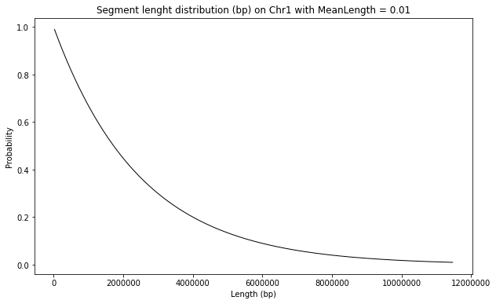
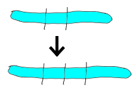
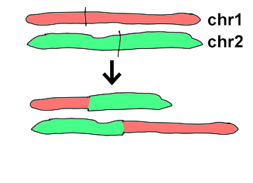
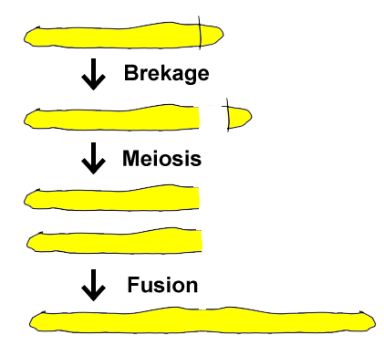
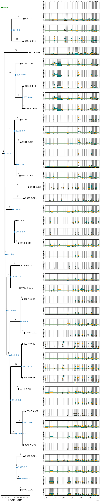

# SimChA: Simulator of Chromosomal Aberrations

SimChA is a research project at SchwarzLab.

## Requirements

### TL;DR; 

The program can be run on a platform of your choice in the provided *Conda* environment. Inside of the repo run 
```
conda env create --file simcha.yml
conda activate simcha
```

### Tested platforms

The program has been tested on:
* Windows 10 - PowerShell
* Windows 10 - WSL2 Ubuntu
* Ubuntu 20
* MacOS X 10 

### Simulation

The simulation code is written in **C# 8**. **.NET 5.0** or newer is requred. We recommend installation using *Conda*:
```
conda install -c conda-forge dotnet
``` 

### Data analysis

The analysis code is written in **Python 3.8**. The following packages are required (either from *Conda* or *Pip*):
```
conda install -c bioconda
conda install -c conda-forge biopython matplotlib numpy pandas seaborn pillow
```

## Execution

The default execution is:
```
git clone git@bitbucket.org:schwarzlab/simcha.git
cd simcha
dotnet run --project SimChA
./plots.sh
```

The results will be written to the folder `./out`

### Options

Use `dotnet run -- [options]` to specify any of the following:

```
  -O, --output    (Default: ./out) The path to the output files.
  -C, --config    (Default: ) A json file with configuration of the experiment.
  -N --newick     (Default: ) A path to a newick file with the phylogenetic tree.
  -D --distance   (Default: 1) A number of mutations (mutation distance) to simulate if a newick file is not provided.
```

## Parameters

Default parameters are found in the file: `default_params.json`.

We simulate a complex set of chromosomal aberrations (copy number changes), whose parametrizations are provided by the configuration file. 

The parameters change based on the nature of the aberration. 

### Likelihood 

A common to all aberrations is `Likelihood`. This is scaled across all aberrations, the probability that an abberation x is selected is the `Likelihood` of x divided by the sum of `Likelihood` across all aberrations.

### MeanLength

For aberrations that affect a subsection of a chromosome, the length of this subsection is sampled from an exponential distribution with `Lambda = 1 / MeanLength`, meaning that the average length of the subsection is the number of bases of the chromosome times `MeanLength`.

The lenght of the selected segment is always at most the length of the chromosome - 2.



**Note:** the length of the chromosome is at the time of the mutation, not the length of the reference!

### Other parameters

The following general parameters are set in the config file.

* `Seed: int` The random seed for mutations generator.
* `IsFemale: bool` The higher the confinement the stronger the competition between clones.

## Aberrations

### Chromosome Deletion

A single chromosome is selected at random and removed.

##### Params:
* `Likelihood: float`.


### Chromosome Duplication

A single chromosome is selected at random and duplicated.

##### Params:
* `Likelihood: float`.

### Tail Deletion

A single chromosome is selected, then an either end thereof, lastly a length of the segmend. The segment is then removed from the end of the chromosome.

##### Params:
* `Likelihood: float`,
* `MeanLength: float`.

### Internal Deletion

A single chromosome is selected, then a length of the segmend. This segment is then removed from a uniformly distrubuted position on the chromosome excluding the first and the last base.

##### Params:
* `Likelihood: float`,
* `MeanLength: float`.

### Internal Duplication
A single chromosome is selected, then a length of the segmend. This segment is then pasted directly after its original position, at a uniformly distrubuted position on the chromosome excluding the first and the last base. 



##### Params:
* `Likelihood: float`,
* `MeanLength: float`.

### Internal Inversion
A single chromosome is selected, then a length of the segmend. This segment is then cut and pasted to the original position in a reversed order, at a uniformly distrubuted position on the chromosome excluding the first and the last base. 

##### Params:
* `Likelihood: float`,
* `MeanLength: float`.

### Translocation
Two chromosomes are selected and on each of those a single uniformly distributed position. 

Each of the choromosomes is split on the position. The first part of the first chromosome is then attached to the second part of the second chromosome and vice versa.



##### Params:
* `Likelihood: float`.

### BreakageFusionBridge

A chromosome and its tail is selected (see above). The tail is then removed, the rest is copied, the copy is reversed and the two copies are connected on the breakage location.




##### Params:
* `Likelihood: float`,
* `MeanLength: float`.

### WholeGenomeDoubling

All the existing chromosomes are duplicated.

##### Params:
* `Likelihood: float`.


### Chromothripsis

TODO

## Output

The text files are primarily used as source for plots shown below.

#### `baf.out`

B-allele frequency of the selected clones. Used for copy number calculation in ASCAT / Refphase.

#### `copynumbers.out`

CN output in the format examplifed as:


| sample_id | chrom | start | end   | cn_a | cn_b |
|-----------|-------|-------|-------|------|------|
|0          |	chr1  |	24721 |	98434 |	1    |   	4 |


#### `logr.out`

Log-R calculation for the selected clones. Used for copy number calculation in ASCAT / Refphase.

#### `parent_graph.dot`

An evolutionary tree with mutation distances and population sizes between the individual subclones. The graph is written in the [DOT language](https://graphviz.org/doc/info/lang.html).

#### `parent_graph.new` 

The same as above, but in the [newick format](https://en.wikipedia.org/wiki/Newick_format).

#### `sim_params.json` 

Stores configuration parameters used for this simulation, including the random seed. If this file is provided on input, the exact same simulation will be executed.

#### `subclones.out`  

Information about the individual subclones at the end of the simulation. This file has the chromosome ranges. A range is in the format:

`ChromID*[start:end)`

where `*` is either `+` for 5' to 3' or `-` for 3' to 5'.

The start position is inclusive, the end exclusive.

### Plots (created by `./plots.sh`)

#### `copy_numbers.png` 
The copy number tracks



## Contact
Email questions, feature requests and bug reports to Adam Streck, adam.streck@mdc-berlin.de.

## License
SimChA is available under the MIT License.