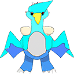

# SimChA: Simulator of Chromosomal Aberrations

SimChA is a research project at SchwarzLab.

## Requirements

### TL;DR; 

The program can be run on a platform of your choice in the provided *Conda* environment. Inside of the repo run 
```
conda env create --file simcha.yml
conda activate simcha
```

### Tested platforms

The program has been tested on:
* Windows 10 - PowerShell
* Windows 10 - WSL2 Ubuntu
* Ubuntu 20
* MacOS X 10 

### Gene Data

The gene data (e.g. PCAWG, TSGs and OGs) is stored using the Git LFS system, so in order for SimChA to work, you will need to download Git LFS (https://git-lfs.com/) and once you have install Git LFS, inside the repo, run:
```
git lfs pull
```


### Simulation

The simulation code is written in **C# 8**. **.NET 6.1** is requred. We recommend installation using *Conda*:
```
conda install -c conda-forge dotnet
``` 

### Data analysis

The analysis code is written in **Python 3.8**. The following packages are required (either from *Conda* or *Pip*):
```
conda install -c bioconda
conda install -c conda-forge biopython matplotlib numpy pandas seaborn pillow
```

## Execution

The default execution is:
```
git clone git@bitbucket.org:schwarzlab/simcha.git
cd simcha
dotnet run --project SimChA
./plots.sh
```

The results will be written to the folder `./out`

### Options

Use `dotnet run -- [options]` to specify any of the following:

```
  -O, --output    (Default: ./out) The path to the output files.
  -C, --config    (Default: ./default_params.json) A json file with configuration of the experiment.
  -N --newick path     A path to a newick file with the phylogenetic tree.
  -R --repeats n   Will run the simulation and generate n independent samples.
  -P --profile path   A path to a file with copy number profiles.
  --data (Default: ./data) The path for the tsv-files with the essential-, tsg- and og-genes with scores. The files should be named: essential.tsv, tsg.tsv, og.tsv and contained in a folder with the same name as the assembly used.
```

## Parameters

Default parameters are found in the file: `default_params.json`. The exact parameters are dependent on the execution mode. The parameters are:

### Common
* `Seed: int` - The seed for the random number generator.
* `SexXX: bool` - If true, uses the XX genome, otherwise the XY genome.
* `Assembly: string` - The assembly to use. Currently hg19 and hg38 are supported.
* `Fitness: { Stress: int, TsgOg: int, Essentiality: int }` - The fitness function to use. The fitness is calculated as the product of the three scores. The scores are weighted by the parameters.

### Repeats mode
* `EventCount: int` - The mean number of events per sample.
* `Distribution: ["Uniform", "Exponential", "Normal"]` - The distribution of the number of events per sample. Uniform means all with be exactly the `EventCount`.

### Simulation mode


## Fitness calculation

### TSG/OG/Eseentiality Score
We use three data files, providing the TSG/OG/Essentiality score. Each file is a tab-separated file with the following columns:

| Chromosome | Start Position | End Position | Gene | Score |
|------------|----------------|--------------|------|-------|
| chr1       | 1000           | 2000         | gene | 0.5   |

For each gene, the:

* TSG score is the probability that the gene is a Tumor Suppresor Gene (TSG) 
* OG score is the probability that the gene is an Oncogene (OG) 
* Essentiality score is the log2 fold change in the reproducibility of a cell after a knock-out of the gene (both alleles).

## Aberrations

### Chromosome Deletion

A single chromosome is selected at random and removed.

##### Params:
* `Prob: float`.


### Chromosome Duplication

A single chromosome is selected at random and duplicated.

##### Params:
* `Prob: float`.

### Tail Deletion

A single chromosome is selected, then an either end thereof, lastly a length of the segmend. The segment is then removed from the end of the chromosome.

##### Params:
* `Prob: float`,
* `Mean: float`.

### Internal Deletion

A single chromosome is selected, then a length of the segmend. This segment is then removed from a uniformly distrubuted position on the chromosome excluding the first and the last base.

##### Params:
* `Prob: float`,
* `Mean: float`.

### Internal Duplication
A single chromosome is selected, then a length of the segmend. This segment is then pasted directly after its original position, at a uniformly distrubuted position on the chromosome excluding the first and the last base. 


##### Params:
* `Prob: float`,
* `Mean: float`.

### Internal Inversion
A single chromosome is selected, then a length of the segmend. This segment is then cut and pasted to the original position in a reversed order, at a uniformly distrubuted position on the chromosome excluding the first and the last base. 

##### Params:
* `Prob: float`,
* `Mean: float`.

### Inverted Duplication
A single chromosome is selected, then a length of the segmend. This segment is then copied and pasted at the end of the segment in a reversed order, at a uniformly distrubuted position on the chromosome excluding the first and the last base. 

##### Params:
* `Prob: float`,
* `Mean: float`.

### Translocation
Two chromosomes are selected and on each of those a single uniformly distributed position. 

Each of the choromosomes is split on the position. The first part of the first chromosome is then attached to the second part of the second chromosome and vice versa.


##### Params:
* `Prob: float`.

### BreakageFusionBridge

A chromosome and its tail is selected (see above). The tail is then removed, the rest is copied, the copy is reversed and the two copies are connected on the breakage location.


##### Params:
* `Prob: float`,
* `Mean: float`.

### WholeGenomeDoubling

All the existing chromosomes are duplicated.

##### Params:
* `Prob: float`.


### Chromothripsis

TODO

### Chromoplexy

TODO

### Pyrgo 

TODO

### Rigma

TODO

### Tyfonas


TODO

## Output

The text files are primarily used as source for plots shown below.

#### `copynumbers.tsv`

CN output in the format examplifed as:


| sample_id | chrom | start | end   | cn_a | cn_b |
|-----------|-------|-------|-------|------|------|
|0          |	chr1  |	24721 |	98434 |	1    |   	4 |

#### `clone_tree.new`

An evolutionary tree with mutation distances and population sizes between the individual subclones. The graph is written in the [newick format](https://en.wikipedia.org/wiki/Newick_format).


#### `sim_params.json` 

Stores configuration parameters used for this simulation, including the random seed. If this file is provided on input, the exact same simulation will be executed.

#### `clones.tsv`  

Information about the individual subclones at the end of the simulation. This file has the chromosome ranges. A range is in the format:

`ChromID*[start:end)`

where `*` is either `+` for 5' to 3' or `-` for 3' to 5'.

The start position is inclusive, the end exclusive.


#### `events.tsv`

Information about the individual events in the simulation. The columns are:

| Id | 	EventType	| EventString	| dFitness |	tFitness |	Mutations |
|----|------------|-------------|----------|-----------|------------|
|  0 | ChromDuplication | contig:23 | 11.53782375 | 11.53782375 | 1 |


### Plots (created by `./plots.sh`)

In order to run `./plots.sh` you first have to install the consistent segmentation routine with by running `python setup.py build_ext --inplace` in the `simcha/scripts/segmentation_cython` directory (with [Cython](https://anaconda.org/anaconda/cython) installed).

#### `copy_numbers_heatmap.png` 
The copy number tracks

## Contact
Email questions, feature requests and bug reports to Adam Streck, adam.streck@mdc-berlin.de.

## License
SimChA is available under the MIT License.
