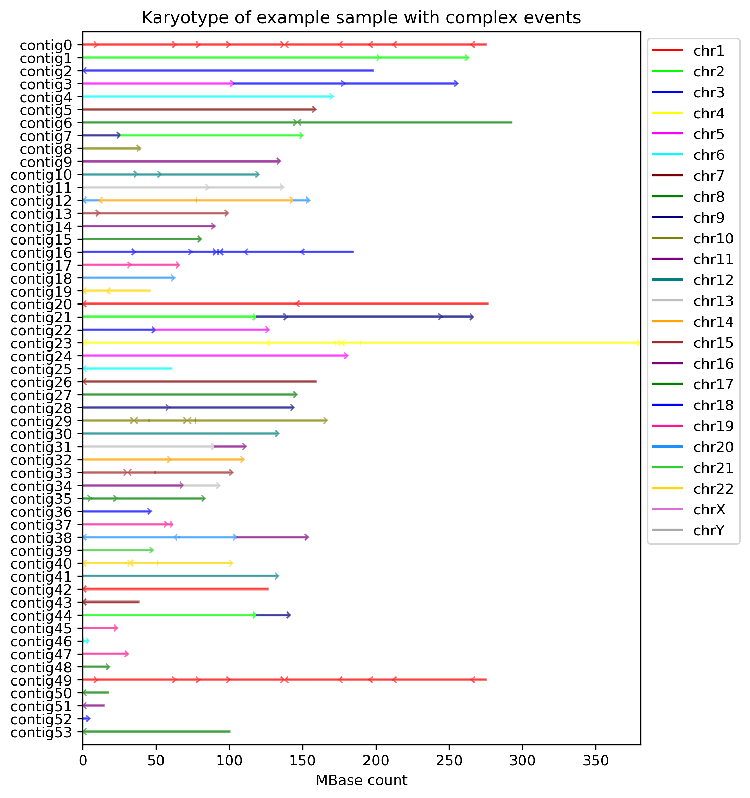
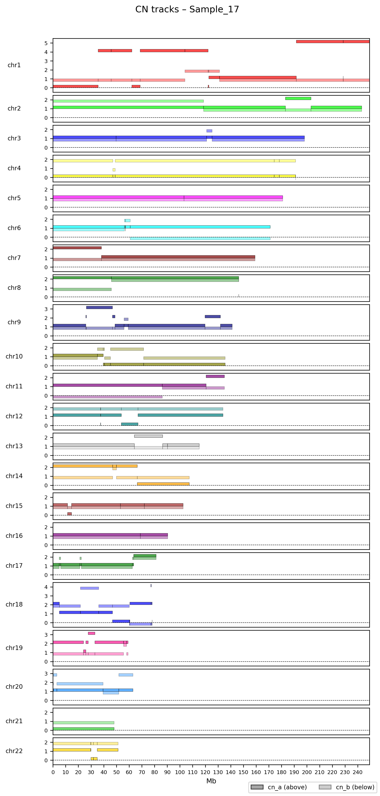

# SimChA: Simulator of Chromosomal Aberrations

<p align="center">

</p>
 
SimChA is a fitness-driven simulator of copy-number evolution. SimChA can simulate 22 event types and SNVs within 25 different cancer types, or use pan-cancer profiles.

SimChA can be used in three ways:
- `repeats N`: generates N repeats of the simulation, 
- `tree <phylogeny>`: generates a tree of clones based on the provided phylogeny structure,
- `profiles <cn_profiles>`: scores the provided CN profiles.

There are three basic modes of fitness:
- `basic`: events are selected at random, without considering fitness.
- `evolution`: events are selected based on their fitness, with a higher chance of selecting events that increase fitness.
- `matching`: events are selected to minimize the distance to a target fitness value provided on input.

The fitness is calculated based on the following principles:
- Tumor Suppressor Genes (TSG) and Oncogenes (OG) contribute to fitness, with TSG loss and OG gain increasing fitness.
- Essential genes contribute to fitness, with their full loss penalizing fitness.
- Abnormally high ploidy is penalized by a stress factor.

## Quick Start

For quickstart, Git >= 2.4 and Conda >= 22 (or equivalent) are required.

The program can be run on a platform of your choice in the provided *Conda* environment. 
The following commands should make SimChA display the available commands.

```
git clone git@bitbucket.org:schwarzlab/simcha.git
cd simcha
conda env create --file simcha.yml
conda activate simcha
dotnet run
```

### Tested platforms

The program has been tested on:
* Windows 11 - PowerShell
* Windows 11 - WSL2 Ubuntu
* Ubuntu 24.04
* MacOS X 10 

## Execution

The repository is a solution (`SimChA.sln`) with two projects: `SimChA`, the simulator,
and `Tests`, the unit test suite. `SimChA` is the default project — its `.csproj` sits at
the repository root (with sources in `src/`), so `dotnet run` runs the simulator directly:

```
git clone git@bitbucket.org:schwarzlab/simcha.git
cd simcha
dotnet run
```

The results will be written to the folder `./out`


### Options

Use `dotnet run -- [options]` to specify any of the following:

```
 
  -O, --output                 (Default: ./out) The path to the output files.

  -C, --config                 (Default: ./configs/main_config.json) A json file with configuration of the experiment.

  -T, --tree <path>            Clone-tree TSV/CSV file path. Required columns: ID, ParentID, Distance (int). Optional column: Fitness (float; only used/required with -m matching). Delimiter can be tab or comma.

  -R, --repeats <int>          (Default: 1) Positive integer number of independent repeats/samples in repeat mode. Optional when omitted (defaults to 1). Cannot be combined with -T or -P when value > 1.

  -P, --cnprofiles <path>      CNA profile TSV file path (tab-separated, header + at least 6 columns): SampleID, Chr, Start, End, CN_hap1, CN_hap2. Extra columns are optional/ignored. Start is interpreted as 1-based by default, or 0-based with -z.

  -m, --mode                   (Default: evolution) The event selection mode: 'basic' (events are selected at random), 'evolution' (events are selected to increase fitness), or 'matching' (events are selected to minimize the distance to a target fitness).

  -s, --segments               (Default: false) Write out copy numbers segments.

  -S, --consistent-segments    (Default: false) Write out copy number segments under a minimum consistent segmentation.

  -K, --karyotypes             (Default: false) Write out the per-sample karyotypes file (karyotypes.tsv).

  -k, --karyotype              (Default: false) Also print the karyotype after each event (adds a 'karyotype' column to events.tsv).

  -d, --delta                  (Default: false) Write out the lost and gained regions for each event.

  -v, --variants               (Default: false) Write out VCF file with the variants of the final simulated karyotype. Requires `data/<assembly>/genome.fa` (e.g. `data/hg19/genome.fa`). Use `scripts/download_ref_data.py` to download it.

  -f, --fasta                  (Default: false) Write out a FASTA file for each sample. Requires `data/<assembly>/genome.fa` (e.g. `data/hg19/genome.fa`). Use `scripts/download_ref_data.py` to download it. WARNING! Average file size is 6GB per sample.

  -z, --zero-index             (Default: false) Flag for zero-indexed input copy number profiles.

  -r, --root                   (Default: none) Override the root folder for resolving relative paths. Takes precedence over the config `Root`; if neither is set, the current working directory is used.

  -a, --assembly               (Default: none) Override the assembly. Takes precedence over `SimParams.Assembly`. An absolute path is used directly; a relative value is resolved under the data folder (`data/<assembly>`).

  -g, --gene_set               (Default: none) Override the gene set. Takes precedence over `FitParams.GeneSet`. An absolute path is used directly; a relative value is resolved under the assembly folder (`<assembly>/<gene_set>`).

  --seed                       (Default: none) Override the RNG seed `SimParams.Seed`. Takes precedence over the config; the config value is used if not given. A negative value draws a random seed.

  -h, --help                       Display this help screen.

  --version                    Display version information.
```

## Input files

Input files are only required for specific execution modes:

| Option | Used for | Required? |
|---|---|---|
| `-R, --repeats <int>` | Repeat-mode simulation (default mode when no `-T`/`-P` is given) | No input file required |
| `-T, --tree <path>` | Tree-mode simulation | Required in tree mode |
| `-P, --cnprofiles <path>` | Profile scoring mode | Required in profiles mode |

### Clone tree file (`-T`, `--tree`)

A `.tsv` or `.csv` file with a header row. The extension determines the separator: tab for `.tsv`, comma for `.csv`.

Columns:

* `ID` (string): clone/sample identifier
* `ParentID` (string): parent clone identifier
* `Distance` (int): number of events from parent to child
* `Fitness` (float): target fitness value — only read when using `-m matching`, otherwise ignored

The root is the row where `ParentID == ID`, or where `ParentID` does not match any `ID` in the file. Exactly one root is expected.

Minimal tree example (`.tsv`):

| ID | ParentID | Distance |
|---|---|---|
| A | A | 0 |
| B | A | 12 |
| C | B | 7 |

Matching-mode example (`.tsv`):

| ID | ParentID | Distance | Fitness |
|---|---|---|---|
| A | A | 0 | 0.0 |
| B | A | 12 | 3.5 |

### CNA profile file (`-P`, `--cnprofiles`)

A tab-separated file with a header row and at least 6 columns per data row. Additional columns are ignored.

First 6 columns (in order):

* `SampleID` (string)
* `Chr` (string, e.g. `chr1`)
* `Start` (int): 1-based by default; use `-z` for 0-based input
* `End` (int)
* `CN_hap1` (numeric, rounded to nearest int)
* `CN_hap2` (numeric, rounded to nearest int)

`chrX` and `chrY` rows are skipped when `SimParams.AutosomesOnly = true`.

Minimal CNA example (`.tsv`):

| SampleID | Chr | Start | End | CN_hap1 | CN_hap2 |
|---|---|---|---|---|---|
| S1 | chr1 | 1 | 248956422 | 1 | 1 |
| S1 | chr8 | 1 | 145138636 | 2 | 1 |

### Path resolution (`--root`)

Relative paths for `-T`, `-P`, `-C`, and output are resolved from the current working directory, or from `--root` if provided.


## Configuration files

Default parameters are found in the file: `./configs/main_config.json`. The exact parameters are dependent on the execution mode.

The default execution corresponds to running

`dotnet run -- --config ./configs/main_config.json`

This contains optimized simple event and fitness parameters for pan-cancer simulation. 

### Cancer-type configs

Pre-built configuration files for each cancer type (and pan-cancer) are provided in `./configs/`, organized into three subfolders:

| Location | Description |
|---|---|
| `configs/spice_<type>.json` | Optimized event profiles (hg19) derived from TCGA/PCAWG data. |
| `configs/hg38/spice_<type>.json` | Same as above with `SimParams.Assembly` set to `"hg38"`. |
| `configs/basic/spice_<type>.json` | Non-optimized profiles - these should be used with `basic` mode, since the WGD probability is not affected by stress. |

`<type>` is the TCGA cancer-type abbreviation (e.g. `LUAD`, `BRCA`) or `pancancer` for the pan-cancer profile.

| File Name | Full Name |
|---|---|
| `ACC` | Adrenocortical Carcinoma |
| `BLCA` | Bladder Urothelial Carcinoma |
| `BRCA` | Breast Invasive Carcinoma |
| `CESC` | Cervical Squamous Cell Carcinoma and Endocervical Adenocarcinoma |
| `COAD` | Colon Adenocarcinoma |
| `ESCA` | Esophageal Carcinoma |
| `GBM` | Glioblastoma Multiforme |
| `HNSC` | Head and Neck Squamous Cell Carcinoma |
| `KIRC` | Kidney Renal Clear Cell Carcinoma |
| `KIRP` | Kidney Renal Papillary Cell Carcinoma |
| `LGG` | Brain Lower Grade Glioma |
| `LIHC` | Liver Hepatocellular Carcinoma |
| `LUAD` | Lung Adenocarcinoma |
| `LUSC` | Lung Squamous Cell Carcinoma |
| `MESO` | Mesothelioma |
| `OV` | Ovarian Serous Cystadenocarcinoma |
| `PAAD` | Pancreatic Adenocarcinoma |
| `PCPG` | Pheochromocytoma and Paraganglioma |
| `PRAD` | Prostate Adenocarcinoma |
| `READ` | Rectum Adenocarcinoma |
| `SARC` | Sarcoma |
| `SKCM` | Skin Cutaneous Melanoma |
| `STAD` | Stomach Adenocarcinoma |
| `TGCT` | Testicular Germ Cell Tumors |
| `UCEC` | Uterine Corpus Endometrial Carcinoma |

### Customizing configuration

#### `SimParams`

The parameters controlling the simulation of events.

* `Seed: int (0)`: The seed for the random number generator. If < 0, the seed will be generated randomly on runtime.
* `Assembly: string ("hg19")`: The reference genome assembly to use (e.g. "hg19", "hg38").
* `Sex: ["Any", "Male", "Female"] ("Any")`: One of `Any`, `Male`, `Female`. If `Any`, then samples' sex will be generated with a random.
* `RateDist: ["Uniform", "Geometric", "Poisson"] ("Uniform")` - The distribution of the mutation rate.
* `RateMean: float (1.0)`: the mean of the mutation rate (mutations between two nodes).
* `TetraploidStart: bool (false)`: If true, the root karyotype will undergo a whole genome doubling before simulation begins.
* `MaxWGD: int (-1)`: The maximum number of whole-genome doublings (WGD) allowed to occur during a single sample's event selection. If a sample's simulation produces more WGDs than this, its event selection is restarted from the parent karyotype and run again until the limit is satisfied. A value of `-1` (the default) disables the limit. This applies to all selection modes (`basic`, `evolution`, `matching`).
* `AutosomesOnly: bool (false)`: If true, karyotypes will only contain autosomes (chromosomes 1-22), excluding sex chromosomes.
* `Mixture: ["Single", "Constant", "Dirichlet"] ("Constant")`: In case of multiple signatures, how are these mixed for each sample. `Single` means that only one signature is used (selected based on its relative probability), `Constant` means that each signature has a fixed probability of being selected, while `Dirichlet` means that the probabilities are drawn from a Dirichlet distribution.

#### `FitParams`

The parameters controlling the fitness of the samples. 

* `Stress: float (0.0)`: Stress penalizes abnormally high ploidy.
* `TsgOg: float (0.0)`: Affected by the number of Tumor Suppressors (TSG) and Oncogenes (OG) in the sample. TSG loss and OG gain increase fitness.
* `Essentiality: float (0.0)`: Penalizes full loss of essential genes.
* `GeneSet: string ("Empty")`: The gene set to use for fitness calculations (e.g. "spice_all"). This should be a folder name relative to the assembly directory.

#### `Signatures`

Signatures define the mutational processes that generate structural variants during simulation. Each signature contains:

* `Name: string`: A descriptive name for the signature.
* `Prob: double`: The relative probability of this signature being selected (compared to other signatures).
* `Events: array`: A list of event types with their parameters and probabilities.

The `Mixture` parameter in `SimParams` controls how multiple signatures are combined:
* `Single`: Only one signature is selected per sample based on relative probabilities.
* `Constant`: Each signature maintains a fixed probability throughout simulation.
* `Dirichlet`: Signature probabilities are drawn from a Dirichlet distribution for each sample.

See the Signatures section below for details on configuring individual event types.

#### Fitness Matching Mode

When using `-m matching` (fitness matching mode), events are selected using the same mechanism as evolution mode, but instead of maximizing fitness, each event is chosen to minimize the distance to a target fitness value. The `EvoParams.MaxTries` parameter controls the full candidate-search budget per step. Across that budget, the existing acceptance rule is still evaluated, but its influence fades smoothly from early tries to late tries, so the search transitions continuously from exploration toward strict best-match selection.

#### `EvoParams`

The parameters controlling the evolutionary mode of event simulation (selection of events based on fitness).

* `Acceptance: float (0.0)`: See publication for details. The higher the value, the less likely an event is to be accepted. Usually between 0 and 1.
* `MaxTries: int (1)`: How many candidate events are sampled before matching mode settles on the best available event or gives up and moves to the next sample.
* `Decay: float (0.0)`: Used in fitness matching mode (`-m matching`). Controls how strongly the acceptance rule influences candidate selection during the early part of the try budget. The decay increases linearly from 0 (first event) to `Decay` (last event), so earlier events get more exploration pressure, while later events lean more quickly toward pure distance-to-target matching.

#### Top-level config fields

Besides the four sections above, the config has two optional top-level fields:

* `Root: string`: the base directory used to resolve all relative paths (see *Working path* below). Read from the config if present, overridable with `-r`/`--root`, and defaults to the current working directory.
* `Version: string`: the SimChA version. Ignored on input; it is stamped with the running version in the output config (`out/sim_params.json`).

The output config also records the **effective** `SimParams.Assembly`, `FitParams.GeneSet`, and `Root` actually used for the run (after applying any command-line overrides), so a run is fully reproducible from its `sim_params.json`.

### Working path

The root folder sets the base directory used to resolve all relative paths. It is taken from the config `Root` if present, can be overridden with `-r`/`--root`, and defaults to `.` (the working directory from which the command is run) — so paths like `./configs/main_config.json` and `./out` resolve relative to it.

If you run SimChA from a different directory — for example via a script or a workflow manager — set `--root` to the repository folder so that default config and output paths resolve correctly without having to specify each one individually:

```bash
dotnet run -- --root /path/to/simcha
```

With this setting, `./configs/main_config.json` resolves to `/path/to/simcha/configs/main_config.json` and `./out` to `/path/to/simcha/out`, regardless of the current working directory.

## Input Data

Reference data is located in the `data/` folder, organized by assembly name (matching `SimParams.Assembly`). 
Each assembly folder needs to contain description of the chromosomes, centromeres, and gene score files in a subfolder (matching `FitParams.GeneSet`). 
We provide `GRCh37` and `GRCh38` in the folders `./data/hg19` and `./data/hg38` respectively.

### Overriding data locations (`-r`, `-a`, `-g`)

The assembly and gene set are read from the config (`SimParams.Assembly` and `FitParams.GeneSet`) and the
root from the config `Root`. Each can be overridden on the command line, with precedence
**command line > config > default**:

* `-r, --root <path>`: the base directory used to resolve all relative paths (config, data, output).
  Defaults to the current working directory.
* `-a, --assembly <value>`: the assembly. An **absolute** path is used directly as the assembly folder
  (the one containing `chromosomes.tsv` and optionally `genome.fa`); a **relative**
  value is resolved under the data folder as `data/<value>` (e.g. `hg19` → `data/hg19`).
* `-g, --gene_set <value>`: the gene set. An **absolute** path is used directly as the gene set folder
  (the one containing the TSG/OG/essentiality score files); a **relative** value is resolved under the
  assembly folder as `<assembly>/<value>`.

A non-existent path produces an error. For example, to read the assembly from a shared absolute location
while keeping the configured gene set:

```bash
dotnet run -- -a /shared/refdata/hg38 -g spice_all
```

The effective root, assembly, gene set, and the SimChA version are written into the output config
(`out/sim_params.json`), so each run records exactly what was used.

### Chromosomes
> `chromosomes.tsv`

One row per chromosome, describing its length together with the reference positions of its
centromere and telomeres. Seven tab-separated columns:

| column | meaning |
| --- | --- |
| `chrom` | chromosome name |
| `length` | number of bases |
| `sex` | `Any`, `Female` or `Male` — which genomes carry the chromosome |
| `tel_p_end` | end of the p-arm telomere, which spans `[0, tel_p_end)` |
| `cen_start` | start of the centromere |
| `cen_end` | end of the centromere, which spans `[cen_start, cen_end)` |
| `tel_q_start` | start of the q-arm telomere, which spans `[tel_q_start, length)` |

All coordinates are 0-based, start-inclusive and end-exclusive, as everywhere else in SimChA. Both
telomeres are anchored to a chromosome end by definition, so each is given by the single coordinate
where it meets the rest of the chromosome. A `.` marks a feature the assembly does not annotate — for
example the p telomere of an acrocentric chromosome whose short arm is unassembled — and that feature
is then simply absent, so no telomere-bound event can occur at that end.

Lines beginning with `#` are comments, and the header is one of them.

Example file:

```
#chrom	length	sex	tel_p_end	cen_start	cen_end	tel_q_start
chr1	248956422	Any	10000	122026459	124932724	248946422
...
chrX	156040895	Female	10000	58605579	62412542	156030895
chrY	57227415	Male	10000	10316944	10544039	57217415
```

The bundled assemblies take chromosome lengths and telomeres from the UCSC gap table; hg19
centromeres come from the same gap table, hg38 centromeres from the UCSC modelled centromeres track
(hg38 has no gap-table centromere records).

### TSG/OG/Eseentiality Score
> `tsgs_select.tsv`, `ogs_select.tsv`, `essentials_select.tsv`

We use three data files, providing the TSG/OG/Essentiality score. Each file is a tab-separated file with the following columns:

* `Chromosome: string` - The name of the chromosome.
* `Start: long` - The start position of the gene (inclusive).
* `End: long` - The end position of the gene (inclusive).
* `Gene: string` - The name of the gene.
* `Score: float` - The score of the gene.

Example file:
```
chr3	178865902	178957881	PIK3CA	1
chr7	140419127	140624564	BRAF	0.991919559
chr12	25357723	25403870	KRAS	0.990684897
...
```

For each gene, the:

* TSG score is the probability that the gene is a Tumor Suppresor Gene (TSG) 
* OG score is the probability that the gene is an Oncogene (OG) 
* Essentiality score is the log2 fold change in the reproducibility of a cell after a knock-out of the gene (both alleles).

### Centromeres and telomeres

These are columns of `chromosomes.tsv` (see above), not separate files. `centromeres.tsv` has been
merged into it, and telomere extents — previously a hard-coded 50 kb — are now read from the same
table.

## Signatures

SimChA simulates events based on mutational signatures. Each signature is a set of events and their associated parameters, for example consider the following excerpt from a configuration file:

```
"Signatures" : [
  {
    "Name" : "WoleChromEvents"
    "Prob": 1,
    "Events": [
      {
        "Type": "ChromDeletion",
        "Prob": 1
      },
      {
        "Type": "ChromDuplication",
        "Prob": 2
      }        
    ]
  },
  {
    "Name": "InternalEvents"
    "Prob": 5,
    "Events": [
      {
        "Type": "InternalDeletion",
        "Prob": 1,
        "Size": 1000000
      },
      {
        "Type": "InternalDuplication",
        "Prob": 7,
        "Size": 500000
      }
    ]
  }
]
```
These are two signatures, one for Whole Chromosome Events and one for Internal events. The likelihood of a signature being selected is 1 : 5, meaning the Internal is 5 times as likely. 

If the WholeChromEvent is selected, the probability of a deletion compared to duplication is 1 : 2. SimChA works with *contigs*, i.e. contiguous sequences of bases. A deletion or duplication will be a deletion or duplication of a contig. A contig may be comprised of parts of different chromosomes, e.g. after a translocation, however at the start of simulation, the set of contigs is the same as the set of chromosomes.

Chromosome events act only on chromosome-like contigs: contigs with complete telomeres at both
physical ends and at least one centromere. The corresponding `ContigDeletion` and
`ContigDuplication` events are unrestricted and can act on any non-empty contig.

If the Internal Deletion is selected, the mean size of a deleted segment will be 1MB, distributed exponentially, while Internal Duplication events will have a mean segment size of 500kB.

Each Event has an associated type and a probability, which is relative to all the other events in the signature. The following events are available:

* `ContigDuplication`
* `ContigDeletion`
* `ChromDuplication`
* `ChromDeletion`
* `TailDuplication`
* `TailDeletion`
* `TelomereDuplication`
* `TelomereDeletion`
* `CentromereBoundDuplication`
* `CentromereBoundDeletion`
* `ArmDuplication`
* `ArmDeletion`
* `InternalDuplication`
* `InternalDeletion`
* `InternalInversion`
* `InvertedDuplication`
* `Translocation`
* `BreakageFusionBridge`
* `WholeGenomeDoubling`
* `Chromothripsis`
* `Chromoplexy`
* `TIChain`
* `TICycle`
* `TIBridge`
* `Pyrgo`
* `Rigma`
* `SNV`
* `Pass`

`TelomereDuplication` and `TelomereDeletion` use the reference-terminal annotations from
`chromosomes.tsv`.
An event is generated only from a physical contig end that still carries the complete
annotation; rearranged internal telomeres and partially deleted telomeres are ineligible.
`TailDuplication` and `TailDeletion` behave the same way but do not require an intact telomere.

Internal, tail and telomere events are all placed on a **terminal arm**: the stretch running inward
from a physical contig end to the centromere nearest that end. The contig and the end are picked in
a single draw proportional to arm length (see *Contig selection*), and an end with no centromere
inward of it is never eligible — so a contig carrying no centromere receives none of these events,
and the interior arms of a fused contig are out of reach. Event length is drawn against the arm
measured to the **middle** of that centromere, which is the scale the empirical event proportions
are fitted against, and is then bounded by the arm proper: a draw longer than the arm becomes a
whole-arm event instead of one reaching into the centromere. No internal, tail or telomere event
can therefore enter or cross a centromere.

Events have parameters from the following:
* `Type: string` - The type of the event, one from the list above.
* `Prob: double` - The probability of the event being selected.
* `Frac: double` - The mean size of the event as a fraction of the region enclosing it: the terminal arm for internal, tail and telomere events, and the contig for centromere-bound events and breakage-fusion-bridge. Lengths follow a bounded Pareto for internal events, a Beta for telomere events, and an exponential everywhere else. `Frac` fixes the mean of that distribution exactly, whatever its shape.
* `Shape: double?` - The second parameter of that length distribution: the shape of the bounded Pareto for internal events, the alpha of the Beta for telomere events. Ignored by the exponential families. Omit it to get the defaults, `Sampling.FixedParetoShape` (0.5) and `Sampling.FixedBetaAlpha` (0.6), which is what every config written before the field existed does. Lowering it makes the distribution more dispersed at the same mean - heavier tail and shorter body for the Pareto, more mass at both ends for the Beta. A mean and a shape together determine the distribution, so fitting the shape is what lets the simulated length *distribution* match rather than only its average.
* `Frag: double` - Some complex events cause fragmentation, this is the mean number of fragments.

#### Contig selection

Once an event type is chosen, the contig(s) it acts on are selected with a probability that depends on the event category:

* **Terminal-arm events** (internal deletion/duplication/inversion, inverted duplication, tail deletion/duplication, telomere deletion/duplication) select one terminal arm across the whole karyotype with probability **proportional to arm length**, which makes both the contig and the end proportional to the sequence the event can actually occupy. Telomere events consider only ends carrying a complete telomere annotation.
* **Breakage-fusion-bridge** selects a monocentric contig with a non-empty terminal arm with probability **proportional to its length**, then selects one of its available ends uniformly.
* **Other within-contig events** (chromothripsis, pyrgo, rigma, SNV) select a contig with probability **proportional to its length** — a longer contig is more likely to contain a given breakpoint.
* **Arm and centromere-bound events** (arm deletion/duplication, centromere-bound deletion/duplication) select a contig with probability **proportional to its number of centromeres**. Contigs without a centromere are never selected; a fused contig carrying several centromeres is proportionally more likely.
* **Contig events** (contig deletion/duplication) select any active contig **uniformly at random**.
* **Chromosome events** (chromosome deletion/duplication) select **uniformly** among active contigs with exactly two intact terminal telomeres and at least one centromere.
* **Translocation** selects two monocentric contigs with non-empty terminal arms **uniformly at random**.
* **Other multi-contig events** (templated insertions, chromoplexy) select contigs **uniformly at random**.

If no contig is eligible for the chosen event — for example a chromosome event when no remaining
contig has two intact terminal telomeres and a centromere, or a terminal-arm event when no
remaining contig carries a centromere — the event cannot be generated and is
**skipped**: it is recorded in the output as a `Skip` event (see below) and leaves the karyotype
unchanged.

### Contig Deletion (Prob)

Any non-empty contig is selected at random and removed.

### Contig Duplication (Prob)

Any non-empty contig is selected at random and duplicated as a separate contig.

### Chromosome Deletion (Prob)

A contig with complete telomeres at both ends and at least one centromere is selected at random
and removed.

### Chromosome Duplication (Prob)

A contig with complete telomeres at both ends and at least one centromere is selected at random
and duplicated as a separate contig.

### Arm Deletion (Prob)

For a contig with at least once centromere, one of the arms is selected at random and removed - the end within the centromere is selected uniformly.

### Arm Duplication (Prob)

For a contig with at least once centromere, one of the arms is selected at random and duplicated - the end within the centromere is selected uniformly.

### Whole Genome Doubling (Prob)

All the existing contigs are duplicated.

### Tail Deletion (Prob, Frac)

A terminal arm is selected and the segment reaching inward from that physical end is removed. Its
length is drawn exponentially using `Frac` and bounded by the arm, so the deletion stops at the
centromere.

### Tail Duplication (Prob, Frac)

A terminal arm is selected and the segment reaching inward from that physical end is duplicated in
tandem at that same end of the same contig. The length is drawn as for `TailDeletion`.

### Telomere Deletion (Prob, Frac)

As `TailDeletion`, except that only an end carrying a complete telomere annotation is eligible and
the length is drawn from the fitted Beta rather than an exponential.

### Telomere Duplication (Prob, Frac)

As `TailDuplication`, except that only an end carrying a complete telomere annotation is eligible
and the length is drawn from the fitted Beta rather than an exponential.

### Internal Deletion (Prob, Frac)

A terminal arm is selected, from which a segment distributed along the `Frac` parameter is removed. The segment lies entirely within that arm and its position there is uniformly distributed.

### Internal Duplication (Prob, Frac)
A terminal arm is selected, from which a segment distributed along the `Frac` parameter is duplicated. The segment lies entirely within that arm and its position there is uniformly distributed. This segment is pasted directly after its original position.

### Internal Inversion (Prob, Frac)
A terminal arm is selected, from which a segment distributed along the `Frac` parameter is inverted. The segment lies entirely within that arm and its position there is uniformly distributed.

### Inverted Duplication (Prob, Frac)
Like a duplication, but the segment is inverted before being pasted.

### Centromere-Bound Duplication (Prob, Frac)

For a contig with at least one centromere, a segment is selected that extends from within the centromere to a distance given by the `Frac` parameter. The breakpoint within the centromere is selected uniformly. This segment is then duplicated.

### Centromere-Bound Deletion (Prob, Frac)

For a contig with at least one centromere, a segment is selected that extends from within the centromere to a distance given by the `Frac` parameter. The breakpoint within the centromere is selected uniformly. This segment is then deleted.

### Translocation  (Prob, Frac)
Two monocentric contigs are selected. One terminal arm is chosen from each and a breakpoint is
sampled uniformly outside its centromere. If the selected arms face opposite directions, the
second contig is inverted before the reciprocal tail swap. The matched breakpoint sides guarantee
that both derivative chromosomes retain exactly one centromere.

### BreakageFusionBridge (Prob, Frac)

A monocentric contig and one of its terminal arms are selected. The first break removes a terminal
segment whose exponential length uses the contig-wide `Frac` scale and is capped at the centromere.
The retained chromosome is copied, the copy is reversed, and the broken sister ends are fused,
forming a dicentric bridge. A final breakpoint is sampled uniformly between the two bridge
centromeres; the daughter containing the original-orientation copy is retained. The completed event
therefore has one centromere and one broken end.

### Chromothripsis (Prob, Frac)

1. A contig is broken into a number of fragments, such that the fragment size is distributed exponentially with a mean of `Frac`.
2. Have, `f` the number of fragments from step 1). A `k` framgents are then randomly selected such that `0 < k <= f`.
3. The `k` fragments are then reassembled in a random order, potentially with inverted orientations.
4. The result is a highly rearranged chromosomal region with multiple breakpoints clustered in one genomic area.

### Chromoplexy (Prob, Frac, Frag)

1. A number `c` of contigs is selected, following the probability distribution listed below.
2. Each contig is broken into a number of fragments, such that the fragment size is distributed under normal distribution with a mean of `Frac`.
3. These contigs are then reassembled in a random order into a single contig.
4. This contig is broken down into  new contigs with mean number of contigs equal to  `Frag`. 

Probabilities are sourced from [Ashby et al., 2019](https://ashpublications.org/blood/article/134/Supplement_1/3767/424006/Chromoplexy-and-Chromothripsis-Are-Important):

* 3 contigs: 46%
* 4 contigs: 18%
* 5 contigs: 10%
* 6 contigs: 5%
* 2 contigs: 21%


### Pyrgo (Prob, Frac, Frag)

1. A contig is selected and a segment of length distributed along `Frac` is chosen.
2. This segment is fragmented into multiple pieces, with the number of fragments drawn from a geometric distribution with mean `Frag`.
3. Each fragment has a length drawn from an exponential distribution with mean `Frac / Frag`.
4. These fragments are then duplicated and randomly inserted throughout the genome, creating dispersed duplications.

### Rigma (Prob, Frac, Frag)

1. A contig is selected and a starting position is chosen.
2. From this position, a series of deletions are made, with the number of deletions drawn from a geometric distribution with mean `Frag`.
3. Each deletion has a length drawn from an exponential distribution scaled by `Frac / Frag`.
4. This creates a pattern of multiple local deletions originating from a single starting point.

### Template Insertion Chain (Prob, Frac, Frag)

1. A number of contigs is selected from a geometric distribution with mean `Frag` (minimum 1).
2. From each contig (except the first and last), a segment is selected with length distributed along `Frac`.
3. The first segment has zero length (just a breakpoint), and the last segment also has zero length.
4. These segments are then chained together sequentially, with random orientations, creating a linear arrangement of templated insertions.
5. The resulting chain is inserted back into the genome as a single new contig.

### Template Insertion Cycle (Prob, Frac, Frag)

1. A number of contigs is selected from a geometric distribution with mean `Frag` (minimum 1).
2. From each contig, a segment is selected with length distributed along `Frac`.
3. Unlike TIChain, all segments (including the first) have non-zero length.
4. These segments are chained together and form a cycle (the last segment connects back to the first).
5. The cycle is then integrated into the genome, creating a circular arrangement of templated insertions.


### Somatic Nucleotide Variants - SNV (Prob)

SimChA is capable of handling the Jukes-Cantor nucleotide substitution model, but to attach proposed SNV events from SimChA to the reference genome, the reference genomes have to be downloaded. To do this, we have provided the `download_ref_data.py` script, which can be run from the root directory of the project as follows:

```
python scripts/download_ref_data.py
```

The download script places the reference FASTA files at `data/hg19/genome.fa` and `data/hg38/genome.fa`.
These files are required when using `-v`/`--variants` and `-f`/`--fasta` (for the assembly selected in `SimParams.Assembly`).

If you only need one reference genome, restrict the download with `--assembly`:

```
python scripts/download_ref_data.py --assembly hg19
```


### Template Insertion Bridge (Prob, Frac, Frag)

1. A number of contigs is selected from a geometric distribution with mean `Frag` (minimum 2).
2. The first segment has zero length (just a breakpoint), while the remaining segments have lengths distributed along `Frac`.
3. These segments are chained together with random orientations.
4. The resulting structure bridges the original breakpoint with templated insertions from other genomic locations.
5. This mimics the mechanism of template switching during DNA repair or replication.

### Pass (Prob)

A no-op event that leaves the karyotype unchanged. `Pass` can be added to a signature like any other event to reserve part of the probability mass for "nothing happens" — i.e. a mutation step that draws this event consumes a step but makes no structural change. It is the only no-op event that is intended to be configured.

### Skip

`Skip` is an internal event that is **not** configured in signatures. It is substituted automatically when a drawn event cannot be applied, in two situations:

* No contig is eligible for the chosen event (e.g. an arm or centromere-bound event when no remaining contig carries a centromere).
* In `evolution`/`matching` modes, the candidate search exhausts `EvoParams.MaxTries` without accepting an event.

Like `Pass`, a `Skip` leaves the karyotype unchanged, but it is still recorded as a row in `events.tsv` so that skipped steps remain visible in the output.

## Output

The text files are primarily used as source for plots shown below.

#### `copynumbers.tsv`

CN output in the format examplifed as:


| sample_id | chrom | start | end   | cn_a | cn_b | n_snvs |
|-----------|-------|-------|-------|------|------|--------|
|0          |	chr1  |	24721 |	98434 |	1    |   	4 |      2 |

#### `sim_params.json` 

Stores configuration parameters used for this simulation, including the random seed. If this file is provided on input, the exact same simulation will be executed.

#### `samples.tsv`  

Information about the individual samples at the end of the simulation.


#### `events.tsv`

Information about the individual events in the simulation. The columns are:

| sample_id |  event_type | depth | description | delta_fitness | total_fitness | num_rejections | signature | regions_gained | regions_lost |
|-----------|-------------|-------|-------------|---------------|---------------|----------------|-----------|----------------|--------------|
| sample_0 | ChromDuplication | 12 | contig:23 | 0.5378 | 11.5378 | 0 | CNA | [H1:chr11[0:135006516)] | [] |
| sample_0 | InternalDuplication | 13 | contig:18;length:59128983;start:49287088;end:50048544 | 0.0000 | 11.5378 | 12 | CNA | [H1:chr19[49287088:50048544)] | [] |
| sample_0 | InternalDeletion | 14 | contig:12;length:115169878;start:2802803;end:7456363 | 0.0000 | 11.5378 | 2 | CNA | [] | [H1:chr13[2802803:7456363)] |

`contig_slots_before` and `contig_slots_after` are always appended to event rows. They count
allocated IDs, including empty contigs. An event growing the count from B to A creates IDs
`[B,A)`; for WGD, parent `i` is copied to `B+i`. These counts preserve original identities
when filtering events. Event descriptions and the existing columns keep their formats.

The `regions_gained`/`regions_lost` columns report the exact copy-number change caused by the event, obtained by
comparing the copy number at each reference position before and after the event. Each entry is
`H<hap>:<chrom>[<start>:<end>)` and appears once per copy gained or lost on that haplotype, with multiple entries
comma-separated inside a `[...]` wrapper. Consecutive intervals are merged independently for each haplotype and
copy-number change layer. Because the comparison is per reference base rather than per region, an event
that merely splits a region — for example an internal deletion that cuts one region into two — reports only the
interval whose copy number actually changed, instead of a spurious loss plus two gains. Copy-number-neutral events
such as inversions and balanced translocations therefore produce no entries.

#### `vcf.tsv`

When using the `-v` or `--variants` flag, generates a simple VCF file of all the observable (i.e. final and nucleotide-altering) SNVs that occurred to the samples during simulation. This requires `data/<assembly>/genome.fa` (for example `data/hg19/genome.fa`), which can be downloaded with `scripts/download_ref_data.py` (see SNV section above).

The file contains standard VCF format headers and columns:

````
##fileformat=VCFv4.3

##source=SimChAV1.0

##reference=verily_hg19_genome.fa

| `#SAMPLEID` | 	CHROM	| POS	| ID |	REF |	ALT |
|----|------------|-------------|----------|-----------|------------|
|  0 | chr1 | 8114090 | . | A | C |
````

#### `genome.fa`

*Note that this only currently works with single-sample simulations* 

Generates the final simulated karyotype sequence from the relevant human genome reference. It will also include the introduced SNVs if applicable.
Using `-f` requires a reference FASTA named `genome.fa` in the selected assembly folder, e.g. `data/hg19/genome.fa` or `data/hg38/genome.fa`. You can create these files with `scripts/download_ref_data.py`.

#### `segments.tsv`

When using the `-s` or `--segments` flag, outputs copy number segments in a simplified format. Each segment represents a contiguous region with uniform copy number state.

#### `consistent_segments.tsv`

When using the `-S` or `--consistent-segments` flag, outputs segments under minimum consistent segmentation. This provides a more refined segmentation that is consistent across all samples in the simulation.

#### `karyotypes.tsv`

When using the `-K` or `--karyotypes` flag, outputs detailed karyotype information. Unlike CN segments, karyotypes retain information about:
* The connections between segments
* Orientations (5' to 3' or 3' to 5')
* Structural relationships between different chromosomal regions
* The complete architecture of derived chromosomes

Each karyotype is represented as a series of regions in the format `ChromID*[start:end)` where `*` is either `+` for 5' to 3' or `-` for 3' to 5'.

#### `vcf.tsv`

When using the `-v` or `--variants` flag, generates a simple VCF file of all the observable (i.e. final and nucleotide-altering) SNVs that occurred to the samples during simulation. This requires `data/<assembly>/genome.fa` (for example `data/hg19/genome.fa`), which can be downloaded with `scripts/download_ref_data.py` (see SNV section above).

### Plots

SimChA outputs can be visualized using the provided Python scripts:

#### Karyotype Plots

Use `scripts/plot_karyotype.py` to visualize the structural arrangement of chromosomes:

```bash
python scripts/plot_karyotype.py --input out/karyotypes.tsv --sample sample_0
```

This generates a horizontal arrow plot showing:
* Each contig as a row
* Chromosomal segments colored by chromosome of origin
* Orientation indicated by arrow direction
* Scale in megabases



#### Copy Number Plots

Use `scripts/plot_cns.py` with the `--cn` flag to visualize allele-specific copy number profiles:

```bash
python scripts/plot_cns.py --input out/karyotypes.tsv --sample sample_0 --cn
```

This generates a per-chromosome CN track plot showing:
* One row per chromosome, scaled proportionally to its CN range
* `cn_a` (major allele) displayed as a rectangle above the CN value
* `cn_b` (minor allele) displayed as a rectangle below the CN value
* Chromosomes colored using consistent chromosome colors
* Shared x-axis scaled to the longest chromosome




#### Additional Plots

When using SimChA as part of optimization workflows (see project-simcha), additional plots are generated including:
* Event frequency heatmaps
* WGD and event count distributions
* Fitness trajectory plots
* Copy number frequency plots across the genome

## Examples

### Basic Simulation

Run a simulation with events selected at random (`-m basic`):

```bash
dotnet run -- --output ./out --config ./configs/main_config.json -m basic
```

### Evolution Mode

Simulate tumor evolution with fitness-based selection using the spice gene set:

```bash
dotnet run -- -O ./out -C ./configs/main_config.json -g spice_all -m evolution
```

### Fitness Matching Mode

Run fitness matching simulation to match target fitness values:

```bash
dotnet run -- -O ./out -C ./configs/main_config.json -m matching
```

### With All Outputs

Generate all available output formats:

```bash
dotnet run -- -O ./out -C ./configs/main_config.json -s -S -K -v -f
```

Note: The `-f` flag generates large FASTA files (~6GB per sample) and should only be used when necessary.

## Performance Considerations

* **Memory**: Each sample requires approximately 100-500 MB depending on event count
* **Runtime**: Typical simulations (100 events, 50 samples) complete in 1-5 minutes
* **FASTA output**: Adds significant time and disk space (~6GB per sample)
* **Parallelization**: SimChA is single-threaded; run multiple instances for parallel simulations

## Running Tests

The `Tests` project is not run by default. Run the test suite manually with:

```
dotnet test
```

To target the test project explicitly:

```
dotnet test test
```

## Hidden-event reduction

`scripts/hidden_events.py` identifies hidden original events using backward contig-version
dependencies. Generate `events.tsv` with `--delta` and `copynumbers.tsv` with `--segments`.

```bash
python scripts/hidden_events.py --events out/events.tsv --copynumbers out/copynumbers.tsv --out out/hidden_events
python scripts/hidden_events.py --events out/events.tsv --copynumbers out/copynumbers.tsv --out out/hidden_events --verify-only
python -m unittest discover -s scripts/tests -p 'test_hidden_events.py'
```

The active algorithm is `backward-contig-dependencies-v4`. Copies depend on the source
version they read. Whole-contig deletion produces an empty version without reading prior
material. Backward demand preserves final germline/WGD-root states and surviving optional
contigs, plus creation and eventual cleanup of any contig used as a template. Undemanded
edits and extinct optional branches disappear. Translocations depend on both inputs;
partial erasure remains conservative. The graph takes O(V + L) time and space.

The earlier certified whole-event cancellation candidate is also calculated, preserving
joint and cross-WGD cancellations that contig-state demand can miss. The candidate with
fewer retained events wins per sample, with backward tracking winning ties. Their removed
sets are never combined. Replay does not select candidates or repair failures.

Two appended log columns, `contig_slots_before` and `contig_slots_after`, preserve numeric
IDs after omitted births and through WGD. Slots include empty contigs. Missing births
reserve absent slots without creating DNA; those slots cannot be read by later commands.
The filter derives these counts for complete legacy histories lacking the columns.

Skip rows are removed by default; `--keep-skip` retains them. WGD always stays at its
original depth and is excluded from the hidden-event denominator.

Outputs include annotations and dependency/version IDs (`hidden_events.tsv`), retained
source commands (`events_filtered.tsv`), flow diagnostics (`reduced_signals.tsv`,
`cn_contributions.tsv`), per-sample exact replay results (`verification.tsv`), and counts,
proportions, input hashes and runtime (`summary.json`, `summary_by_event_type.tsv`).
`retention_method` identifies which candidate won. Cancellation groups certify removals
only for cancellation-selected samples. `effective_cn_intervals` is diagnostic metadata
containing full original contributions; it is never substituted for a source command.

The sole replay check executes retained original operations from diploid phased germline.
Whole deletion clears its current target, independent of the old length printed in its
description. Coordinates and stable contig IDs retain SimChA's operation semantics.
Only final material coverage is compared against CN; intermediate logged gained/lost
regions are ignored. Verification reports `filtered_original_operations_v3` and
`filtered_replay_pass` / `filtered_replay_fail`. Fresh outputs are published only after
all samples pass; `--verify-only` updates saved results even on failure.

All 12,000 regenerated pipeline benchmark histories pass. Selection removes
27,903 / 430,373 non-WGD rows (6.48%); neutral removes 37,395 / 421,481 (8.87%), including
66 Skip rows. Neutral's CN-changing fraction is 37,329 / 421,415 (8.86%). All 45 regression
tests pass, including 50 independently simulated histories and the archived Sample_650
and Sample_4479 examples. The latter retains the deletions needed for its visible CN steps.

Inputs must be complete independent lineages from diploid phased germline, one event
per depth, with contiguous sample groups and complete 1-based CN segments. Expand
shared-ancestor tree tables into complete lineages first. Unsupported operations fail.

## Contact
Email questions, feature requests and bug reports to Adam Streck, `adam.streck@iccb-cologne.org`.

## License
SimChA is available under the MIT License.
